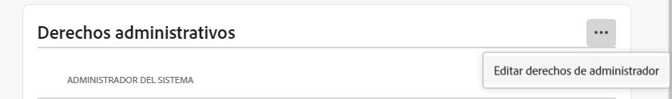

# Funciones administrativas

Con Adobe Admin Console, las organizaciones pueden definir una jerarquía administrativa flexible que permita una administración precisa del acceso y uso de los productos de Adobe. Uno o más administradores del sistema, aprovisionados durante el proceso de incorporación empresarial, se sientan en la parte superior de la jerarquía. Estos administradores del sistema pueden delegar responsabilidades a otros administradores, manteniendo al mismo tiempo el control general.

Las funciones administrativas proporcionan a las empresas las siguientes ventajas clave:

* Descentralización controlada de las responsabilidades administrativas
* Vista rápida de las asignaciones de productos, por usuario y por producto
* Funcionalidad para asignar cuotas a los administradores de productos

## Jerarquía administrativa

Se aplica a: Adobe de clientes empresariales.

La jerarquía administrativa puede utilizarse para adaptarse a los requisitos únicos de su empresa. Por ejemplo, una empresa puede designar diferentes administradores para que administren las autorizaciones de las ofertas de Adobe Creative Cloud y Adobe Marketing Cloud. Como alternativa, una empresa puede tener diferentes administradores para administrar las autorizaciones de los usuarios que pertenecen a diferentes unidades de negocio.

>[!NOTE]
>
>La jerarquía administrativa no se aplica a los clientes de equipos. Los clientes de equipos tienen un solo **Administrador del sistema** función. El propietario del contrato (_anteriormente denominado **Administrador principal**_) es el administrador del sistema con acceso a los detalles del contrato y al historial de facturación. Si es el propietario del contrato actual, puede designar un administrador del sistema existente (_ anteriormente denominado **administrador secundario**_) como propietario del contrato.

_Jerarquía de funciones de administrador_

| Función | Descripción |
|--- |--- |
| **Administrador del sistema** | Superusuario de la organización; se permite realizar todas las tareas administrativas en el Admin Console. Además, tiene permisos para delegar la siguiente funcionalidad administrativa a otros usuarios: Administrador de productos, administrador de perfiles de producto, administrador de grupos de usuarios, administrador de implementación y administrador de asistencia. |
| **Administrador de productos** | Administra los productos asignados a ese administrador y todas las funciones administrativas asociadas, que incluyen:<ul><li>Creación de perfiles de producto</li><li>Agregar usuarios y grupos de usuarios a la organización, pero no eliminarlos</li><li>Agregar o quitar usuarios y grupos de usuarios de perfiles de producto</li><li>Agregar o quitar administradores de perfil de producto de perfiles de producto</li><li>Agregar o quitar otros administradores de productos del producto</li><li>Agregar o quitar administradores de grupo de grupos</li></ul> |
| **Administrador del perfil de producto** | Administra las descripciones de perfil de producto asignadas a ese administrador y todas las funciones administrativas asociadas, que incluyen:<ul><li>Agregar usuarios y grupos de usuarios a la organización, pero no eliminarlos</li><li>Agregar o quitar usuarios y grupos de usuarios de perfiles de producto</li><li>Asignación o revocación de permisos de producto para usuarios y grupos de usuarios desde perfiles de producto</li><li>Administrar funciones de producto de usuarios y grupos de usuarios para perfiles de producto |
| **Administrador del grupo de usuarios** | Administra las descripciones de grupo de usuarios asignadas a ese administrador y todas las funciones administrativas asociadas, que incluyen:<ul><li>Agregar o quitar usuarios de grupos</li><li>Agregar o quitar administradores de grupos de usuarios de grupos |
| **Administrador de implementación** | Crea, administra e implementa paquetes de software y actualizaciones para usuarios finales. |
| **Administrador de asistencia** | Función no administrativa que tiene acceso a información relacionada con la asistencia, como los informes de problemas notificados por el cliente. |
| **Administrador de almacenamiento** | Gestiona la administración del almacenamiento de información de la organización. El administrador puede ver el consumo de almacenamiento de los usuarios activos e inactivos y transferir el contenido a otros destinatarios. |

Para obtener una lista detallada de permisos y privilegios para cada función de administrador, consulte [Permisos](#enterprise-admins-permissions-matrix).

## Agregar una función de administrador de empresa {#add-enterprise-role}

Se aplica a: Adobe de clientes empresariales.

Como administrador, puede asignar un rol de administrador a otros usuarios, otorgándoles los mismos privilegios que tiene, o privilegios para un rol bajo su rol de administrador en la jerarquía como se describe [above](#administrative-hierarchy). Por ejemplo, como administrador de producto, puede otorgar privilegios de administrador de producto o privilegios de administrador de perfil de producto a un usuario, pero no privilegios de administrador de implementación. Para obtener los permisos del Admin Console, consulte la [Matriz de permisos](#enterprise-admins-permissions-matrix).

Para agregar o invitar a un administrador:

1. En el [Admin Console](https://adminconsole.adobe.com/), elija **Usuarios** > **Administradores**.

   Como alternativa, vaya al producto, perfil de producto o grupo de usuarios correspondiente y navegue hasta el **Administradores** pestaña .

1. Haga clic en **Agregar administrador**.
1. Introduzca un nombre o una dirección de correo electrónico. Puede buscar usuarios existentes o agregar un nuevo usuario especificando una dirección de correo electrónico válida y rellenando la información en la pantalla.
1. Haga clic en **Siguiente**. Aparece una lista de funciones de administrador.

>[!NOTE]
>
>* Las opciones de esta pantalla dependen de la cuenta y de la función de administrador. Puede otorgar los mismos privilegios que tiene, o privilegios para una función bajo la suya en la jerarquía.
>* Como administrador del sistema de un equipo, solo puede asignar una función de administrador: Administrador del sistema.

1. Seleccione una o varias funciones de administrador.
1. Para los tipos de administrador como Administrador de productos, Administrador de perfiles de producto y Administrador de grupos de usuarios, seleccione los productos, perfiles y grupos específicos, respectivamente.

>[!NOTE]
>
>Para un administrador de perfil de producto, puede incluir perfiles de más de un producto.

1. Revise las funciones de administrador asignadas al usuario y haga clic en **Guardar**.

El usuario recibe una invitación por correo electrónico con respecto a los nuevos privilegios administrativos de `message@adobe.com`.

Los usuarios deben hacer clic en **Introducción** en el correo electrónico para unirse a la organización. Si los nuevos administradores no utilizan la variable **Introducción** en la invitación por correo electrónico, no podrían iniciar sesión en el Admin Console.

Como parte del proceso de inicio de sesión, es posible que se pida a los usuarios que configuren un perfil de Adobe si todavía no lo tienen. Si los usuarios tienen varios perfiles asociados con su dirección de correo electrónico, los usuarios deben elegir &quot;Unirse al equipo&quot; (si se les solicita) y luego seleccionar el perfil asociado con la nueva organización.

## Agregar un administrador de equipos {#add-admin-teams}

Se aplica a: Adobe equipos clientes.

Como administrador, puede asignar la función de administrador del sistema a otros usuarios, otorgándoles los mismos privilegios que tiene.

Para agregar o invitar a un administrador del sistema:

1. En el Admin Console, elija **Usuarios** > **Administradores**.

   Se muestra una lista de administradores existentes.

1. Haga clic en **Agregar administrador**.

   La variable **Agregar un administrador** se abre.

1. Introduzca un nombre o una dirección de correo electrónico. Puede buscar usuarios existentes o agregar un nuevo usuario especificando una dirección de correo electrónico válida y rellenando la información en la pantalla.

   De forma predeterminada, System Administrator está seleccionado.

1. Haga clic en **Guardar**.

Dado que todos los usuarios de una organización de equipos son usuarios de Business ID, reciben una invitación por correo electrónico con respecto a los nuevos privilegios administrativos de `message@adobe.com`.
Los usuarios deben hacer clic en Introducción en el correo electrónico para unirse a la organización.

Como parte del proceso de inicio de sesión, es posible que se pida a los usuarios que configuren un perfil de Adobe si todavía no lo tienen. Si los usuarios tienen varios perfiles asociados con su dirección de correo electrónico, los usuarios deben elegir &quot;Unirse al equipo&quot; (si se les solicita) y luego seleccionar el perfil asociado con la nueva organización.

## Editar rol de administrador empresarial

Se aplica a: Adobe de clientes empresariales.

Como administrador, puede editar la función de administrador a otros administradores que se encuentran debajo de usted en la jerarquía administrativa. Por ejemplo, puede eliminar los privilegios de administrador de otros administradores.

Para editar los roles de administrador:

1. En el Admin Console, elija **Usuarios** > **Administradores**. Se muestra la lista de administradores existentes.

   Como alternativa, vaya al producto, perfil de producto o grupo de usuarios correspondiente y navegue hasta el **Administradores** pestaña .

1. Haga clic en el nombre del administrador que desea editar.
1. En el **Detalles del usuario**, haga clic en  para el **Derechos administrativos** y elija **Editar derechos de administrador**.

   

1. Edite los derechos administrativos y guarde los cambios.

## Editar rol de administrador de equipos

Se aplica a: Adobe equipos clientes.

Como administrador del sistema de equipos, puede eliminar los privilegios de administrador del sistema de otros administradores.

Para revocar los privilegios de administrador del sistema:

1. En el Admin Console, elija **Usuarios** > **Administradores**.

   Se muestra la lista de administradores existentes.

1. En Detalles del usuario, haga clic en  a la derecha del **Derechos administrativos** y elija **Editar derechos de administrador**.

   

1. Edite los derechos administrativos y guarde los cambios.

## Eliminar un administrador

Se aplica a: Adobe de equipos de clientes empresariales.

1. Para revocar permisos de administrador, seleccione un usuario y haga clic en **Eliminar administrador**.

>[!NOTE]
>
>Al eliminar un administrador, no se elimina el usuario del Admin Console, sino que solo se eliminan los privilegios asociados con el rol de administrador.

## Matriz de permisos de los administradores de Enterprise

Se aplica a: Adobe de clientes empresariales.

La siguiente tabla enumera todos los permisos para los distintos tipos de administradores, clasificados por las siguientes áreas de funcionalidad:

### Administración de identidades

| Permiso | Administrador del sistema | Administrador de asistencia |
|--- |--- |--- |
| Añadir dominio (solicitar/reclamar un dominio) | š |  |
| Ver listado de dominios y dominios | š |  |
| Administrar claves de cifrado de dominio | š |  |
| Administrar la directiva de contraseñas de organización predeterminada | š |  |
| Ver directiva de contraseña de organización predeterminada | š |  |

### Administración de usuarios

| Permiso | Administrador del sistema | Administrador de asistencia |
|--- |--- |--- |
| Agregar usuario a organización | š |  |
| Eliminar usuario de organización | š |  |
| Ver detalles de usuario y listado | š |  |
| Editar perfil de usuario | š |  |
| Agregar perfil de producto al usuario o grupo | š |  |
| Eliminar el perfil de producto al usuario o grupo | š |  |
| Agregar perfil de producto a varios usuarios | š |  |
| Ver perfiles de producto para un usuario | š |  |
| Ver lista de usuarios del producto | š |  |
| Añadir usuarios masivamente a la organización | š |  |

### Administración de administradores

| Permiso | Administrador del sistema | Administrador de asistencia |
|--- |--- |--- |
| Otorgar administrador de organización a un usuario | š |  |
| Revocar el administrador de organización de un usuario | š |  |
| Otorgar administrador de licencias de producto a un usuario | š |  |
| Revocar el administrador de licencias de productos de un usuario | š |  |
| Otorgar administrador de implementación a un usuario | š |  |
| Revocar el administrador de implementación de un usuario | š |  |
| Otorgar administrador de grupos de usuarios a un usuario | š |  |
| Revocar el administrador de grupos de usuarios de un usuario | š |  |
| Otorgar administrador de propietario de producto a un usuario | š |  |
| Revocar el administrador del propietario del producto de un usuario | š |  |

### Administración de la configuración de la licencia del producto

| Permiso | Administrador del sistema | Administrador de asistencia |
|--- |--- |--- |
| Otorgar derechos de producto a organización |  |  |
| Eliminar la asignación de productos de la organización |  |  |
| Ver el número total de licencias propiedad de la organización | š |  |
| Ver productos disponibles y familias de productos | š |  |
| Editar descripciones/datos de licencias de productos | š |  |
| Proporcionar licencia de producto a un usuario | š |  |
| Desaprovisionar licencia de producto de un usuario | š |  |
| Añadir nueva configuración de licencia de producto | š |  |
| Editar la configuración del servicio de licencias de producto | š |  |
| Eliminar la configuración del servicio de licencias de producto | š |  |
| Eliminación del acceso al producto de un usuario (eliminación de todas las configuraciones) | š |  |

### Administración del almacenamiento

| Permiso | Administrador del sistema | Administrador de asistencia |
|--- |--- |--- |
| Ver carpetas de usuario activas e inactivas | š |  |
| Eliminar carpetas de usuario inactivas y transferir contenido | š |  |

### Implementación

| Permiso | Administrador del sistema | Administrador de asistencia |
|--- |--- |--- |
| Ficha Ver/usar paquetes | š |  |

### Asistencia

| Permiso | Administrador del sistema | Administrador de asistencia |
|--- |--- |--- |
| Ver ficha de compatibilidad | š |  |
| Administrar casos de asistencia | š | š |

### Administración de grupos de usuarios

| Permiso | Administrador del sistema | Administrador de asistencia |
|--- |--- |--- |
| Crear grupo de usuarios | š |  |
| Quitar grupo de usuarios | š |  |
| Agregar usuario al grupo de usuarios | š |  |
| Eliminar usuario del grupo de usuarios | š |  |
| Asignar grupo de usuarios a una licencia de producto | š |  |
| Quitar grupo de usuarios de la licencia del producto | š |  |
| Ver miembro del grupo de usuarios | š | š |
| Ver lista de grupos de usuarios | š | š |
