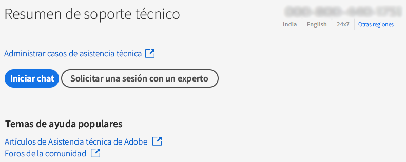
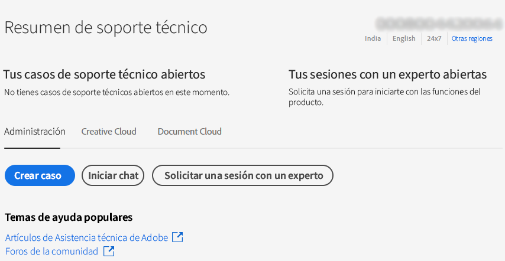
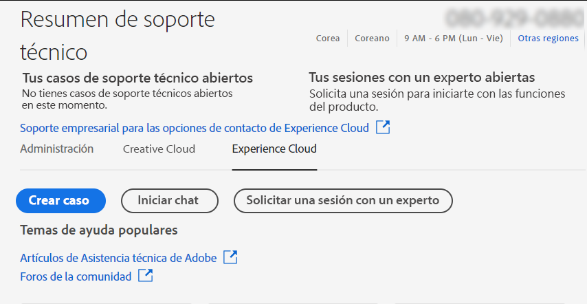

# Empresas y equipos | Contactar con el servicio de Atención al cliente de Adobe

Para ponerse en contacto con el servicio de Atención al cliente de Adobe, vaya a la pestaña **Asistencia técnica** en [Admin Console](https://adminconsole.adobe.com/).

La **pestaña Asistencia técnica** en [Admin Console](https://adminconsole.adobe.com/) le permite acceder a varias opciones de asistencia a través de una interfaz sencilla y fácil de usar. Las opciones disponibles en la pestaña Asistencia técnica dependen de su plan de suscripción. Para obtener más información, haga clic en **Más información** correspondiente a su plan de suscripción.

Si no tiene claro cuál es su plan de suscripción, vaya a la **pestaña Asistencia técnica** en [Admin Console](https://adminconsole.adobe.com/) y compare su vista con las imágenes siguientes. A continuación, haga clic en el enlace **Más información**.

## Para la cuenta de equipos

<!--
[Learn more](https://helpx.adobe.com/enterprise/using/support-for-teams.html)
-->

## Para la cuenta de empresa

<!--
[Learn more](https://helpx.adobe.com/enterprise/using/support-for-enterprise.html)
-->

## Para Experience Cloud

<!--
[Learn more](https://www.adobe.com/go/ac_ec_not_supported_en)
-->
