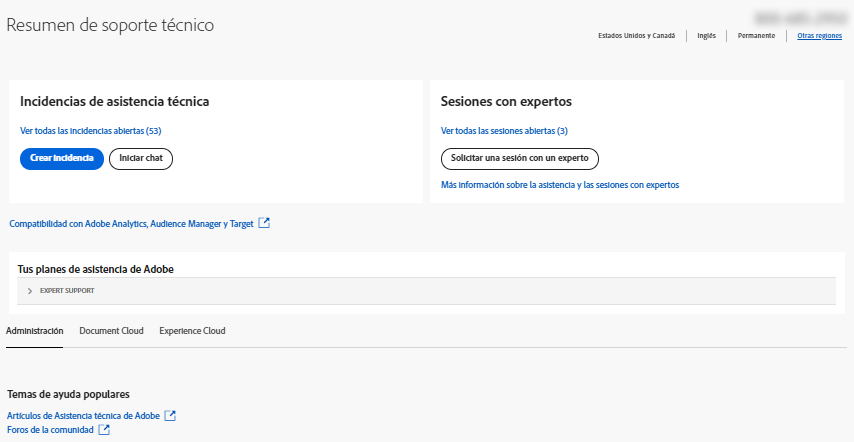

# Enterprise y equipos | Servicio de atención al cliente del Adobe de contacto

Para ponerse en contacto con el Servicio de atención al cliente de Adobe, vaya a la **Asistencia** en la ficha [Admin Console](https://adminconsole.adobe.com/).

La variable **Pestaña Asistencia** en el [Admin Console](https://adminconsole.adobe.com/) le permite acceder a varias opciones de asistencia a través de una interfaz sencilla y fácil de usar. Las opciones disponibles en la pestaña Asistencia dependen de su plan de suscripción. Para obtener más información, haga clic en **Más información** correspondiente a su plan de suscripción.

Si no está seguro sobre su plan de suscripción, vaya a la **Pestaña Asistencia** en el [Admin Console](https://adminconsole.adobe.com/)y compare su vista con las imágenes siguientes. A continuación, haga clic en el **Más información** vínculo.

## Para la cuenta de equipos

[Más información](https://helpx.adobe.com/enterprise/using/support-for-teams.html)

## Para la cuenta de empresa

[Más información](https://helpx.adobe.com/enterprise/using/support-for-enterprise.html)

## Para Experience Cloud

[Más información](https://www.adobe.com/go/ac_ec_not_supported_en)
