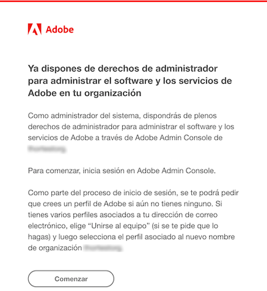
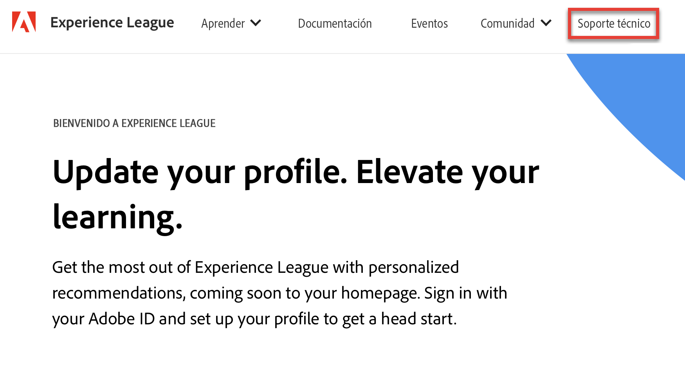
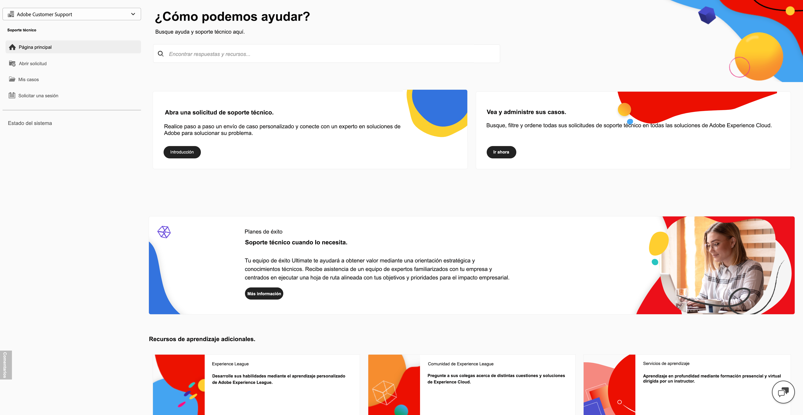
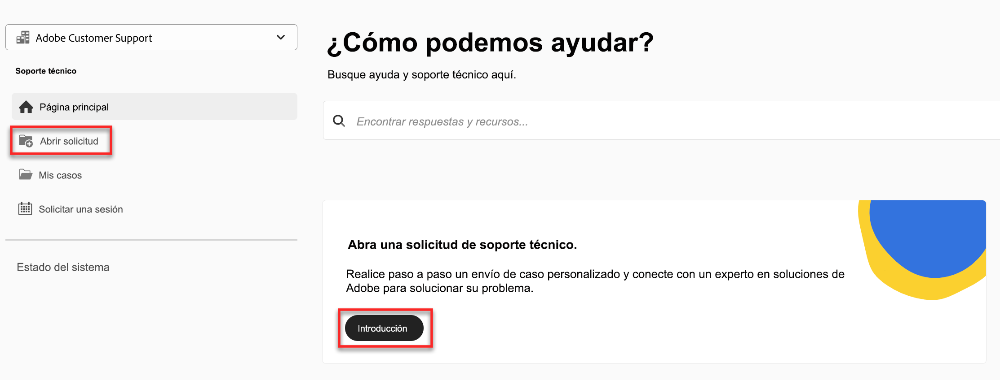
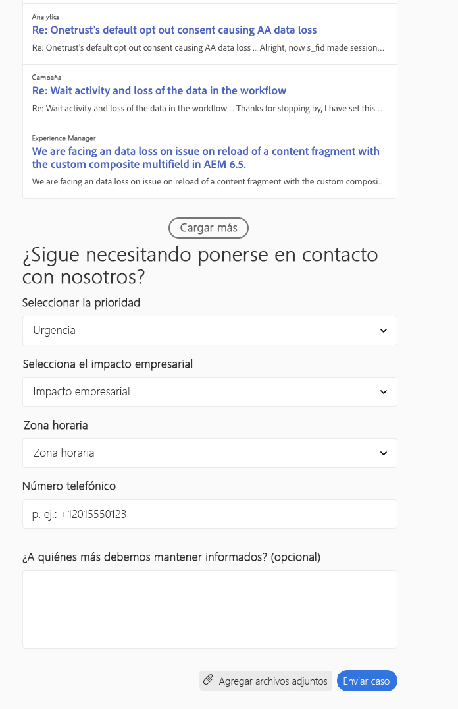

# Experiencia de asistencia al cliente de Adobe

## Solicitudes de soporte técnico de Experience League

Las solicitudes de soporte técnico ahora se envían a través de [Experience League](https://experienceleague.adobe.com/home?support-tab=home&lang=es#support). Para ver las instrucciones acerca de cómo enviar una solicitud de soporte técnico, revise la sección para el [envío de una solicitud de soporte técnico](#create-a-support-ticket-with-experience-league).

Estamos trabajando para mejorar su forma de interactuar con el servicio de atención al cliente de Adobe. Nuestra visión es optimizar la experiencia de asistencia con un punto de acceso único a través de Experience League. Una vez en funcionamiento, su organización podrá acceder fácilmente al servicio de atención al cliente de Adobe, tener una mayor visibilidad del historial de servicios a través de un sistema común para todos los productos y solicitar ayuda por teléfono, sitio web y chat a través de este portal único.

Si es usuario de Adobe Commerce, consulte [Enviar un caso de soporte técnico](https://experienceleague.adobe.com/es/docs/commerce-knowledge-base/kb/help-center-guide/magento-help-center-user-guide#support-case) en la Guía del usuario del Centro de ayuda de Adobe Commerce.

## Funciones con derecho de soporte necesarias para el envío de casos {#submit-ticket}

Para enviar una solicitud de soporte técnico en [Experience League](https://experienceleague.adobe.com/home?support-tab=home&lang=es#support), debe tener la función de administrador de soporte asignada por un administrador del sistema. Solo un administrador del sistema de su organización puede asignar esta función. Producto, Perfil de producto y otras funciones administrativas no pueden asignar la función de administrador de asistencia, y tampoco pueden ver la opción **[!UICONTROL Crear caso]** para enviar una solicitud de soporte técnico. Para obtener más información sobre los distintos tipos de funciones de administrador y sus derechos, consulte [Funciones de administrador](admin-roles.md).

Si está en Commerce, el proceso para compartir el acceso para trabajar con casos de soporte técnico es diferente. Para obtener más información, consulte [Acceso compartido: conceda privilegios para que otros usuarios accedan a su cuenta](https://experienceleague.adobe.com/es/docs/commerce-knowledge-base/kb/help-center-guide/magento-help-center-user-guide#shared-access) en la Guía del usuario del Centro de ayuda de Adobe Commerce.

### Agregar asistencia da derecho a funciones a una organización

La función de administrador de asistencia es una función no administrativa que ofrece acceso a información relacionada con el servicio de asistencia. Los administradores de asistencia pueden ver, crear y administrar informes de problemas.

Para agregar o invitar a un administrador:

1. En Admin Console, elija **[!UICONTROL Usuarios]** > **[!UICONTROL Administradores]**.
1. Haga clic en **[!UICONTROL Agregar administrador]**.
1. Introduzca un nombre o una dirección de correo electrónico.

   Puede buscar usuarios existentes o agregar un nuevo usuario especificando una dirección de correo electrónico válida y rellenando la información en la pantalla.

   

1. Haga clic en **[!UICONTROL Siguiente]**. Aparece una lista de funciones de administrador.

Para asignar una función de administrador de soporte a un usuario (permitir que un usuario pueda ponerse en contacto con el servicio de asistencia):

1. Seleccione la opción **[!UICONTROL Administrador de soporte]**.

   

1. Elija una de las dos opciones siguientes:

   * Opción 1: **[!UICONTROL Administrador de asistencia básica]**. Seleccione esta opción si desea proporcionar al usuario acceso a la asistencia para todas las soluciones (excepto Marketo Engage).
   * Opción 2: **[!UICONTROL Administrador de asistencia de producto]**: seleccione esta opción para la asistencia de Marketo Engage. Seleccione las instancias de Marketo Engage que darán al usuario acceso a la asistencia.

   

1. Una vez realizadas las selecciones, haga clic en **[!UICONTROL Guardar]**.

El usuario recibe una invitación por correo electrónico con respecto a los nuevos privilegios administrativos de `message@adobe.com`.

Los usuarios deben hacer clic en **Empezar** en el correo electrónico para unirse a la organización. Si los nuevos administradores no utilizan el enlace **Empezar** de la invitación por correo electrónico, no podrían iniciar sesión en Admin Console.

Como parte del proceso de inicio de sesión, es posible que se pida a los usuarios que configuren un perfil de Adobe si todavía no lo tienen. Si los usuarios tienen varios perfiles asociados a su dirección de correo electrónico, deben elegir **Unirse al equipo** (si se les solicita) y luego seleccionar el perfil asociado a la nueva organización.

Para obtener más información, consulte las instrucciones de [editar rol de administrador de empresa](admin-roles.md#add-enterprise-role) en la documentación de funciones administrativas. Tenga en cuenta que solo un administrador del sistema de su organización puede asignar esta función. Para obtener más información sobre la jerarquía administrativa, visite la documentación sobre [funciones administrativas](admin-roles.md).

### Creación de una solicitud de soporte técnico con Experience League

>[!NOTE]
>
> Antes de enviar un ticket de asistencia, considere la posibilidad de comprobar el rendimiento del sistema Adobe, la disponibilidad y los problemas de la solución en el sitio [estado de Adobe](https://status.adobe.com).

El proceso de envío de casos de soporte técnico ahora está directamente integrado en la plataforma de soporte técnico de Experience League. Se trata de un portal de autoservicio rediseñado recientemente para ofrecer una mayor personalización y facilidad de uso a los clientes.

1. Para crear una solicitud con [Experience League](https://experienceleague.adobe.com/home?support-tab=home&lang=es#support), seleccione la pestaña **[!UICONTROL Soporte técnico]** que se encuentra en la barra de navegación superior.
   
1. Desde la página de inicio de soporte técnico, puede navegar fácilmente a los casos de soporte técnico abiertos, registrar un caso nuevo, ver los principales artículos de soporte técnico o acceder a recursos de aprendizaje adicionales.
   
1. Para enviar un caso, seleccione **[!UICONTROL Abra una solicitud de soporte técnico]**. Seleccione también la opción **[!UICONTROL Abrir incidencia]** en el menú de la barra lateral.

### Rellene el ticket de asistencia

1. Después de seleccionar **[!UICONTROL Abrir un ticket de soporte técnico]**, se le dirigirá a la página de creación de casos, donde podrá introducir el nombre de su producto (Audience Manager, Campaign, Target, etc.), **[!UICONTROL Título del caso]** y **[!UICONTROL Descripción del caso]**.

   

   Para acelerar el proceso de solución de problemas, agregue la siguiente información en el campo **[!UICONTROL Descripción del caso]**:

   * Borrar declaración de problema
   * Pasos a seguir
   * Declaración de impacto comercial
   * ¿Se trata de una nueva implementación, función o desarrollo?
   * ¿Cuándo funcionó el proceso?
   * Pasos para solucionar problemas
   * Datos de registro relevantes
   * Número de versión
   * Información de compilación (si corresponde)
   * Identificadores críticos

1. Al seleccionar cualquier solución, se le solicita lo siguiente, y algunas soluciones tienen campos adicionales:

   * Prioridad del caso (baja, media, alta, crítica)
   * Impacto empresarial
   * Zona horaria del cliente (América, EMEA, APAC)

   Para obtener más información sobre cómo la prioridad de casos y el impacto en la empresa afectan los tiempos de respuesta de soporte, consulte [Tiempos de respuesta iniciales objetivo para soporte](https://experienceleague.adobe.com/en/docs/support-resources/data-sheets/overview#targeted-initial-response-times-for-support) en la Documentación de recursos de planes de éxito.

>[!TIP]
>
> Si no puede ver la opción **[!UICONTROL Crear caso]** o la pestaña **[!UICONTROL Soporte técnico]**, debe ponerse en contacto con un administrador del sistema para asignar la función de administrador de soporte técnico.

>[!NOTE]
>
> Si el problema implica interrupciones o cortes graves en un sistema de producción, se proporciona un número de teléfono para obtener asistencia inmediata.

<!--

## What About the Legacy Systems?

New Tickets/Cases will no longer be able to be submitted in legacy systems as of May 11th.  The [Admin Console](https://adminconsole.adobe.com/) will be used to submit new tickets/cases.

### Existing Tickets/Cases

* Between May 11th and May 20th the legacy systems will remain available to work existing tickets/cases to completion.
* Beginning May 20th the support team will migrate remaining open cases from the legacy systems to the new support experience.  You will receive an email notification regarding how to contact support to continue to work these cases.
-->
