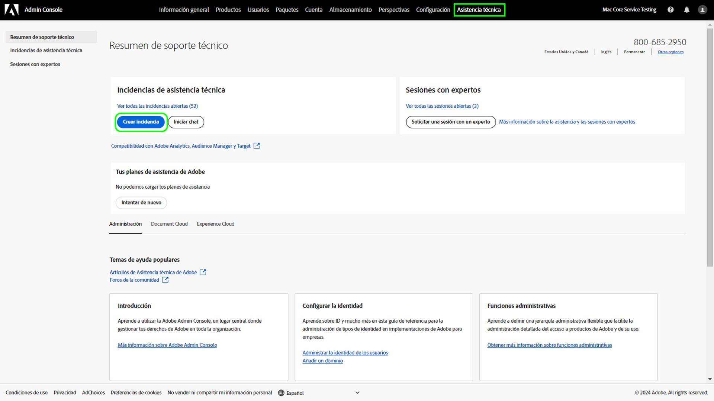
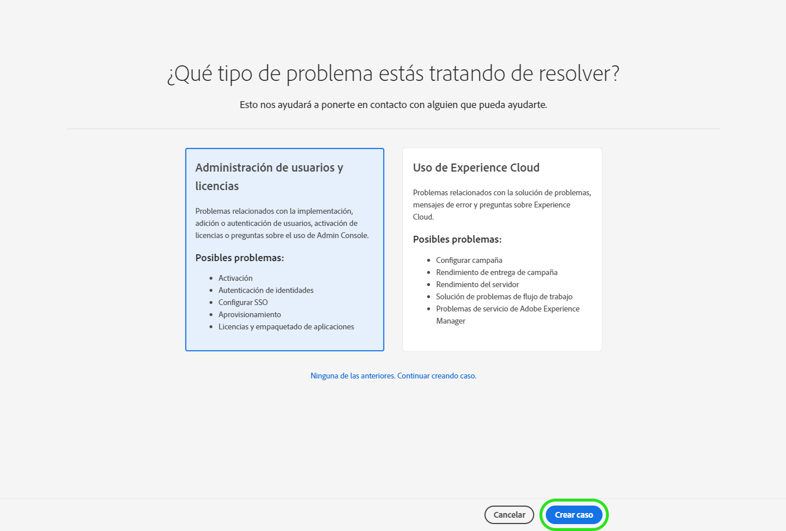
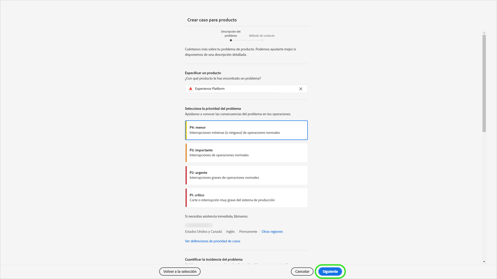
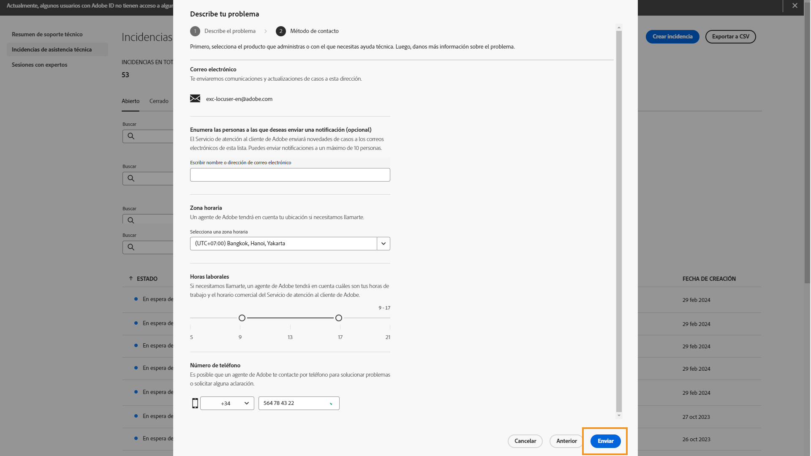

# Experiencia de asistencia al cliente de Adobe

## Tickets de asistencia en Admin Console

Los tickets de asistencia ya se pueden enviar a través de [Admin Console](https://adminconsole.adobe.com/). Para ver las instrucciones acerca de cómo enviar un ticket de asistencia, revise la sección para el [envío de tickets de asistencia](#submit-ticket).

Como ya hemos compartido anteriormente, nuestro cometido es mejorar su interacción con la asistencia al cliente de Adobe, empezando por Adobe Experience Manager y los productos de Campaign. Nuestra visión es optimizar la experiencia de asistencia con un punto de acceso único a través de Adobe Admin Console. Una vez en funcionamiento, su organización podrá acceder fácilmente al servicio de asistencia al cliente de Adobe, tener una mayor visibilidad del historial de servicios a través de un sistema común para todos los productos, y solicitar ayuda por teléfono, sitio web y chat a través de este portal único.

## Envío de tickets de asistencia en Admin Console {#submit-ticket}

Para enviar un ticket de asistencia en [Admin Console](https://adminconsole.adobe.com/), debe tener la función de administrador de soporte asignada por un administrador del sistema. Solo un administrador del sistema de su organización puede asignar esta función. Producto, Perfil de producto y otras funciones administrativas no pueden asignar la función de administrador de asistencia, y tampoco pueden ver la opción **[!UICONTROL Crear caso]** para enviar un ticket de asistencia. Para obtener más información, consulte la documentación del [servicio de atención al cliente para empresas y equipos](https://helpx.adobe.com/es/enterprise/using/support-and-expert-services.html).

### Asignación de la función de administrador de asistencia

La función de administrador de asistencia es una función no administrativa que ofrece acceso a información relacionada con el servicio de asistencia. Los administradores de asistencia pueden ver, crear y administrar informes de problemas.

Para asignar la función de administrador de asistencia, siga las instrucciones de [editar función de administrador empresarial](https://helpx.adobe.com/es/enterprise/using/admin-roles.html#add-admin-teams) en la documentación de funciones administrativas. Tenga en cuenta que solo un administrador del sistema de su organización puede asignar esta función. Para obtener más información sobre la jerarquía administrativa, visite la documentación sobre [funciones administrativas](https://helpx.adobe.com/es/enterprise/admin-guide.html/enterprise/using/admin-roles.ug.html).

### Creación de un ticket de asistencia con Admin Console

Para crear un ticket con [Admin Console](https://adminconsole.adobe.com/), seleccione la pestaña **[!UICONTROL Asistencia técnica]** que se encuentra en la barra de navegación superior. Aparecerá la página [!UICONTROL Resumen de asistencia]. A continuación, seleccione la opción **[!UICONTROL Crear caso]**.

>[!TIP]
>
> Si no puede ver la opción **[!UICONTROL Crear caso]** o la pestaña **[!UICONTROL Asistencia técnica]**, debe ponerse en contacto con un administrador del sistema para asignar la función de administrador de asistencia.

Aparecerá un cuadro de diálogo donde podrá seleccionar un tipo de problema. Seleccione el tipo de problema que mejor describa su problema o pregunta y, a continuación, seleccione **[!UICONTROL Crear caso]** en la parte inferior derecha.

Aparecerá el cuadro de diálogo **[!UICONTROL Crear caso]**. Se le pedirá que proporcione información, como el producto, la prioridad y la descripción, y que adjunte capturas de pantalla para describir el problema. Seleccione **[!UICONTROL Siguiente]** para continuar.

>[!NOTE]
>
> Si el problema implica interrupciones o cortes graves en un sistema de producción, se proporciona un número de teléfono para obtener asistencia inmediata.

La siguiente página le permite rellenar la información de contacto y proporcionar el mejor momento para que el servicio de asistencia al cliente de Adobe se ponga en contacto con usted. Una vez haya acabado, seleccione **[!UICONTROL Enviar]** en la parte inferior derecha para enviar el ticket al servicio de asistencia al cliente de Adobe.

## ¿Qué pasa con los sistemas heredados?

Los nuevos tickets/casos ya no podrán enviarse en sistemas heredados a partir del 11 de mayo.  [Admin Console](https://adminconsole.adobe.com/) se utilizará para enviar nuevos tickets/casos.

### Tickets/casos existentes

* Entre el 11 y el 20 de mayo, los sistemas heredados permanecerán disponibles para trabajar con los tickets/casos existentes hasta su finalización.
* A partir del 20 de mayo, el equipo de asistencia migrará los casos pendientes de los sistemas heredados a la nueva experiencia de asistencia.  Recibirá una notificación por correo electrónico donde se le explicará cómo ponerse en contacto con el servicio de asistencia para seguir trabajando en estos casos.

