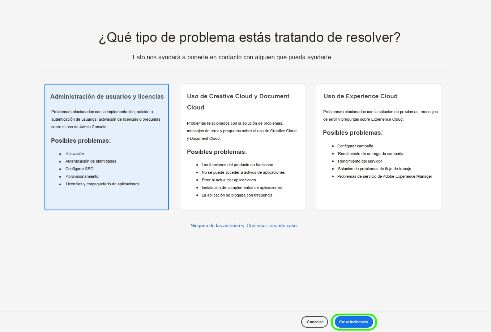

# Nueva experiencia de asistencia al cliente de Adobe

## Tickets de asistencia de Admin Console

Estamos encantados de anunciar que la nueva experiencia de asistencia al cliente de Adobe estará activa desde el 11 de mayo de 2020.

Los tickets de asistencia ya se pueden enviar a través de [Admin Console](https://adminconsole.adobe.com/).. Para obtener instrucciones sobre cómo enviar un ticket de soporte, revise la sección para [enviar un ticket de soporte](#submit-ticket).

Como ya hemos compartido anteriormente, nuestro cometido es mejorar su interacción con la asistencia al cliente de Adobe, empezando por Adobe Experience Manager y los productos de Campaign. Nuestra visión es optimizar la experiencia de asistencia con un punto de acceso único a través de Adobe Admin Console. Una vez en funcionamiento, su organización podrá acceder fácilmente al servicio de asistencia al cliente de Adobe; tengan buena visibilidad del historial de servicios a través de un sistema común entre productos; y solicitar ayuda por teléfono, web y chat a través de un solo portal.

## Envío de un ticket de soporte para Admin Console {#submit-ticket}

Para enviar un vale de soporte en [Admin Console](https://adminconsole.adobe.com/), debe tener la función de administrador de soporte asignada por un administrador del sistema. Solo un administrador del sistema de su organización puede asignar esta función. Product, Product Profile y otras funciones administrativas no pueden asignar la función de administrador de asistencia y no pueden ver la opción **[!UICONTROL Create Case]** utilizada para enviar un ticket de asistencia. Para obtener más información, consulte la documentación de [atención al cliente de Enterprise y de equipos](https://helpx.adobe.com/es/enterprise/using/support-and-expert-services.html).

### Asignación de la función de administrador de asistencia técnica

La función de administrador de asistencia es una función no administrativa que tiene acceso a la información relacionada con la asistencia. Los administradores de asistencia técnica pueden ver, crear y administrar informes de problemas.

Para asignar la función de administrador de asistencia, siga las instrucciones [edit enterprise admin role](https://helpx.adobe.com/enterprise/using/admin-roles.html#add-admin-teams) de la documentación de funciones administrativas. Tenga en cuenta que solo un administrador del sistema de su organización puede asignar esta función. Para obtener más información sobre la jerarquía administrativa, consulte la documentación de [funciones administrativas](https://helpx.adobe.com/enterprise/admin-guide.html/enterprise/using/admin-roles.ug.html).

### Creación de un ticket de asistencia técnica con el Admin Console

Para crear un ticket con [Admin Console](https://adminconsole.adobe.com/), seleccione la pestaña **[!UICONTROL Support]** ubicada en la barra de navegación superior. Aparece la página [!UICONTROL Resumen de soporte]. A continuación, seleccione la opción **[!UICONTROL Create Case]**.

>[!TIP]
>
> Si no puede ver la opción **[!UICONTROL Create Case]** o la pestaña **[!UICONTROL Support]**, debe ponerse en contacto con un administrador del sistema para asignar la función de administrador de asistencia.

Aparece un cuadro de diálogo que le permite seleccionar un tipo de problema. Seleccione el tipo de problema que mejor describe su problema o pregunta y, a continuación, seleccione **[!UICONTROL Crear caso]** en la parte inferior derecha.

Aparece el cuadro de diálogo **[!UICONTROL Crear caso]**. Se le pedirá que proporcione información como el producto, la prioridad, la descripción y adjunte cualquier captura de pantalla para ayudar a describir el problema. Seleccione **[!UICONTROL Siguiente]** para continuar.

>[!NOTE]
>
> Si el problema resulta en interrupciones o interrupciones extremadamente graves en un sistema de producción, se proporciona un número de teléfono para obtener asistencia inmediata.

La siguiente página le permite rellenar la información de contacto y proporcionar el mejor momento para que el servicio de asistencia al cliente de Adobe se ponga en contacto con usted. Una vez finalizado, seleccione **[!UICONTROL Submit]** en la parte inferior derecha y el ticket se enviará al servicio de asistencia al cliente de Adobe.

## ¿Qué pasa con los sistemas heredados?

Los nuevos tickets/casos ya no podrán enviarse en sistemas heredados a partir del 11 de mayo.  [Admin Console](https://adminconsole.adobe.com/) se utilizará para enviar nuevos tickets/casos.

### Tickets/casos existentes

* Entre el 11 y el 20 de mayo, los sistemas heredados permanecerán disponibles para trabajar con los tickets/casos existentes hasta su finalización.
* A partir del 20 de mayo, el equipo de asistencia migrará los casos pendientes de los sistemas heredados a la nueva experiencia de asistencia.  Recibirá una notificación por correo electrónico donde se le explicará cómo ponerse en contacto con el servicio de asistencia para seguir trabajando en estos casos.

### Historial de casos

El historial de casos cerrados estará visible para el personal de asistencia de Adobe.  Si necesita ayuda con un caso cerrado, consulte la sección ¿Necesita ayuda? a continuación.

## ¿Necesita ayuda?

Después del lanzamiento, si tiene problemas y no puede iniciar sesión en la nueva herramienta, tiene las siguientes opciones:

### Opción 1: Enviar un ticket

Póngase en contacto con nosotros abriendo un ticket de [Experience League](https://experienceleague.adobe.com/?support-solution=General&amp;lang=es#support) e incluya esto:

* Detalles de contacto: nombre, dirección de correo electrónico y teléfono
* Nombre de la empresa
* Producto de Adobe
* Prioridad del problema
* Descripción breve del problema

### Opción 2: Antes del 11 de mayo

Antes del 11 de mayo, aún podrá utilizar los sistemas de gestión de casos heredados de [Campaign Extranet](https://support.neolane.net/webApp/extranetLogin) o [Experience Manager Daycare](https://daycare.day.com/home.html).  A partir del 11 de mayo, se le redirigirá a [Admin Console](https://adminconsole.adobe.com/), ya que estos sistemas no aceptarán casos nuevos.

Si tiene alguna pregunta relacionada con este correo electrónico, póngase en contacto con nosotros abriendo un ticket de [Experience League](https://experienceleague.adobe.com/?support-solution=General#support).
