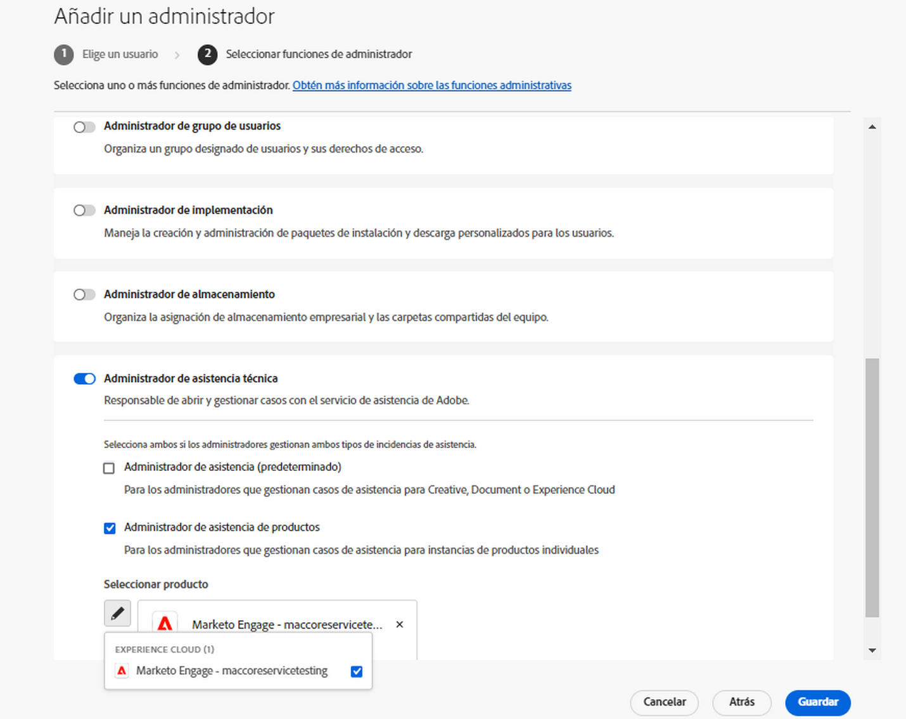

# Experiencia de asistencia al cliente de Adobe

## Entradas de soporte al Experience League

Los tickets de soporte ahora se envían a través de [Experience League](https://experienceleague.adobe.com/home#support). Para ver las instrucciones acerca de cómo enviar un ticket de asistencia, revise la sección para el [envío de tickets de asistencia](#submit-ticket).

Estamos trabajando para mejorar su forma de interactuar con el servicio de Atención al cliente de Adobe. Nuestro objetivo es optimizar la experiencia de asistencia trasladándose a un único punto de entrada mediante Experience League. Una vez en funcionamiento, su organización podrá acceder fácilmente al servicio de asistencia al cliente de Adobe, tener una mayor visibilidad del historial de servicios a través de un sistema común para todos los productos, y solicitar ayuda por teléfono, sitio web y chat a través de este portal único.

Si es un usuario de Adobe Commerce, consulte [Enviar un caso de asistencia](https://experienceleague.adobe.com/en/docs/commerce-knowledge-base/kb/help-center-guide/magento-help-center-user-guide#support-case) en la Guía del usuario de asistencia para Experience League de Adobe Commerce.

## Compatibilidad con las funciones necesarias para el envío de casos {#submit-ticket}

Para enviar un ticket de asistencia en [Experience League](https://experienceleague.adobe.com/home#support), necesita que un administrador del sistema le asigne la función de administrador de asistencia. Solo un administrador del sistema de su organización puede asignar esta función. Producto, Perfil de producto y otras funciones administrativas no pueden asignar la función de administrador de asistencia, y tampoco pueden ver la opción **[!UICONTROL Crear caso]** para enviar un ticket de asistencia. Para obtener más información sobre los distintos tipos de funciones de administrador y sus derechos, consulte [Funciones de administrador](admin-roles.md).

Si está en Commerce, el proceso para compartir el acceso para trabajar con casos de asistencia es diferente. Para obtener más información, consulte [Acceso compartido: otorga privilegios para que otros usuarios accedan a tu cuenta](https://experienceleague.adobe.com/en/docs/commerce-knowledge-base/kb/help-center-guide/magento-help-center-user-guide#shared-access) en la Guía del usuario de soporte técnico para Experience League de Adobe Commerce.

### Añadir asistencia da derecho a los roles a una organización

La función de administrador de asistencia es una función no administrativa que ofrece acceso a información relacionada con el servicio de asistencia. Los administradores de asistencia pueden ver, crear y administrar informes de problemas.

Para agregar o invitar a un administrador:

1. En Admin Console, elija **[!UICONTROL Usuarios]** > **[!UICONTROL Administradores]**.
1. Haga clic en **[!UICONTROL Agregar administrador]**.
1. Introduzca un nombre o una dirección de correo electrónico.

   Puede buscar usuarios existentes o agregar un nuevo usuario especificando una dirección de correo electrónico válida y rellenando la información en la pantalla.

   

1. Haga clic en **[!UICONTROL Siguiente]**. Aparece una lista de funciones de administrador.

Para asignar una función de administrador de soporte a un usuario (permitir que un usuario pueda ponerse en contacto con el servicio de asistencia):

1. Seleccione la opción **[!UICONTROL Administrador de soporte]**.

   

1. Elija una de las dos opciones siguientes:

   * Opción 1: **[!UICONTROL Administrador de asistencia básica]**. Seleccione esta opción si desea proporcionar al usuario acceso a la asistencia para todas las soluciones (excepto Marketo Engage).
   * Opción 2: **[!UICONTROL Administrador de asistencia de producto]**: seleccione esta opción para la asistencia de Marketo Engage. Seleccione las instancias de Marketo Engage que darán al usuario acceso a la asistencia.

   

1. Una vez realizadas las selecciones, haga clic en **[!UICONTROL Guardar]**.

El usuario recibe una invitación por correo electrónico con respecto a los nuevos privilegios administrativos de `message@adobe.com`.

Los usuarios deben hacer clic en **Empezar** en el correo electrónico para unirse a la organización. Si los nuevos administradores no utilizan el enlace **Empezar** de la invitación por correo electrónico, no podrían iniciar sesión en Admin Console.

Como parte del proceso de inicio de sesión, es posible que se pida a los usuarios que configuren un perfil de Adobe si todavía no lo tienen. Si los usuarios tienen varios perfiles asociados a su dirección de correo electrónico, deben elegir **Unirse al equipo** (si se les solicita) y luego seleccionar el perfil asociado a la nueva organización.

Para obtener más información, consulte las instrucciones de [editar rol de administrador de empresa](admin-roles.md#add-enterprise-role) en la documentación de funciones administrativas. Tenga en cuenta que solo un administrador del sistema de su organización puede asignar esta función. Para obtener más información sobre la jerarquía administrativa, visite la documentación sobre [funciones administrativas](admin-roles.md).

### Creación de un vale de asistencia con el Experience League

El proceso de envío de casos de asistencia ahora está directamente integrado con la plataforma de asistencia del Experience League. Se trata de un portal de autoservicio rediseñado recientemente para ofrecer una mayor personalización y facilidad de uso a los clientes habituales.

1. Para crear un ticket con [Experience League](https://experienceleague.adobe.com/home#support), seleccione la ficha **[!UICONTROL Asistencia]** que se encuentra en la barra de navegación superior.
   
1. Desde la página de inicio de la asistencia, puede navegar fácilmente a sus casos de asistencia abiertos, registrar un caso nuevo, ver los artículos de asistencia principales o acceder a fuentes de aprendizaje adicionales.
   
1. Para enviar un caso, selecciona **[!UICONTROL Abrir un ticket de asistencia]**. Seleccione también la opción **[!UICONTROL Abrir incidencia]** en el menú de la barra lateral. Se le dirigirá a la página de creación de casos, donde puede introducir el nombre del producto (Audience Manager, Campaña, Destinatario, etc.), el título del caso y la descripción del caso. Para acelerar el proceso de resolución de problemas, sea lo más descriptivo posible al describir el problema que enfrenta.
   
1. Hacia el final del formulario, rellene los campos siguientes. Al seleccionar cualquier solución, se le solicita lo siguiente, y algunas soluciones tienen campos adicionales:

   * Prioridad de casos (bajo, Medium, alto, crítico)
   * Impacto empresarial
   * Zona horaria del cliente (América, EMEA, APAC)

>[!TIP]
>
> Si no puede ver la opción **[!UICONTROL Crear caso]** o la pestaña **[!UICONTROL Asistencia técnica]**, debe ponerse en contacto con un administrador del sistema para asignar la función de administrador de asistencia.

>[!NOTE]
>
> Si el problema causa interrupciones o interrupciones graves en un sistema de producción, se proporciona un número de teléfono para obtener asistencia inmediata.

<!--

## What About the Legacy Systems?

New Tickets/Cases will no longer be able to be submitted in legacy systems as of May 11th.  The [Admin Console](https://adminconsole.adobe.com/) will be used to submit new tickets/cases.

### Existing Tickets/Cases

* Between May 11th and May 20th the legacy systems will remain available to work existing tickets/cases to completion.
* Beginning May 20th the support team will migrate remaining open cases from the legacy systems to the new support experience.  You will receive an email notification regarding how to contact support to continue to work these cases.
-->
