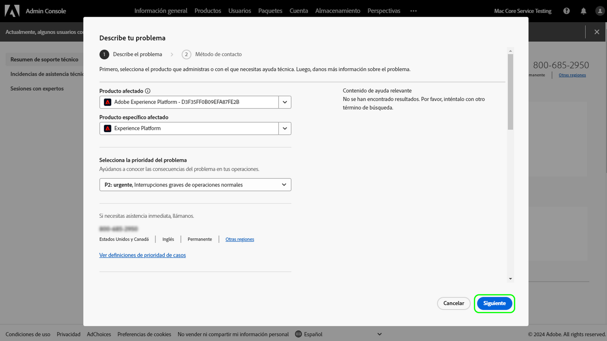

# Experiencia de asistencia al cliente de Adobe

## Tickets de asistencia en Admin Console

Los tickets de asistencia ya se pueden enviar a través de [Admin Console](https://adminconsole.adobe.com/). Para ver las instrucciones acerca de cómo enviar un ticket de asistencia, revise la sección para el [envío de tickets de asistencia](#submit-ticket).

Estamos trabajando para mejorar su forma de interactuar con el servicio de Atención al cliente de Adobe. Nuestra visión es optimizar la experiencia de asistencia con un punto de acceso único a través de Adobe Admin Console. Una vez en funcionamiento, su organización podrá acceder fácilmente al servicio de asistencia al cliente de Adobe, tener una mayor visibilidad del historial de servicios a través de un sistema común para todos los productos, y solicitar ayuda por teléfono, sitio web y chat a través de este portal único.

## Envío de tickets de asistencia en Admin Console {#submit-ticket}

Para enviar un ticket de asistencia en [Admin Console](https://adminconsole.adobe.com/), debe tener la función de administrador de soporte asignada por un administrador del sistema. Solo un administrador del sistema de su organización puede asignar esta función. Producto, Perfil de producto y otras funciones administrativas no pueden asignar la función de administrador de asistencia, y tampoco pueden ver la opción **[!UICONTROL Crear caso]** para enviar un ticket de asistencia. Para obtener más información, consulte la documentación del [servicio de atención al cliente para empresas y equipos](customer-care.md).

### Asignación de la función de administrador de asistencia

La función de administrador de asistencia es una función no administrativa que ofrece acceso a información relacionada con el servicio de asistencia. Los administradores de asistencia pueden ver, crear y administrar informes de problemas.

Para agregar o invitar a un administrador:

1. En Admin Console, elija **[!UICONTROL Usuarios]** > **[!UICONTROL Administradores]**.
1. Haga clic en **[!UICONTROL Agregar administrador]**.
1. Introduzca un nombre o una dirección de correo electrónico.

   Puede buscar usuarios existentes o agregar nuevos especificando una dirección de correo electrónico válida y rellenando la información de la pantalla.

   

1. Haga clic en **[!UICONTROL Siguiente]**. Aparece una lista de funciones de administrador.

Para asignar una función de administrador de soporte a un usuario (permitir que un usuario pueda ponerse en contacto con el servicio de asistencia):

1. Seleccione el **[!UICONTROL Administrador de soporte]** opción.

   

1. Elija una de las dos opciones siguientes:

   * Opción 1: **[!UICONTROL Administrador de asistencia básica]**. Seleccione esta opción si desea proporcionar al soporte técnico acceso para todas las soluciones (excepto Marketo).
   * Opción 2: **[!UICONTROL Administrador de soporte de productos]**: seleccione esta opción para la compatibilidad con Marketo. Seleccione las instancias de Marketo que darán acceso a la asistencia al usuario.

   

1. Una vez realizadas las selecciones, haga clic en **[!UICONTROL Guardar]**.

El usuario recibe una invitación por correo electrónico con respecto a los nuevos privilegios administrativos de `message@adobe.com`.

Los usuarios deben hacer clic en **Empezar** en el correo electrónico para unirse a la organización. Si los nuevos administradores no utilizan el enlace **Empezar** de la invitación por correo electrónico, no podrían iniciar sesión en Admin Console.

Como parte del proceso de inicio de sesión, es posible que se pida a los usuarios que configuren un perfil de Adobe si todavía no lo tienen. Si los usuarios tienen varios perfiles asociados a su dirección de correo electrónico, los usuarios deben elegir **Unirse al equipo** (si se le solicita) y, a continuación, seleccione el perfil asociado a la nueva organización.

### Creación de un ticket de asistencia con Admin Console

Para crear un ticket con [Admin Console](https://adminconsole.adobe.com/), seleccione la pestaña **[!UICONTROL Asistencia técnica]** que se encuentra en la barra de navegación superior. Aparecerá la página [!UICONTROL Resumen de asistencia]. A continuación, seleccione la opción **[!UICONTROL Crear caso]**.

>[!TIP]
>
> Si no puede ver la opción **[!UICONTROL Crear caso]** o la pestaña **[!UICONTROL Asistencia técnica]**, debe ponerse en contacto con un administrador del sistema para asignar la función de administrador de asistencia.

Aparecerá un cuadro de diálogo donde podrá seleccionar un tipo de problema. Seleccione el tipo de problema que mejor describa su problema o pregunta y, a continuación, seleccione **[!UICONTROL Crear caso]** en la parte inferior derecha.

Aparecerá el cuadro de diálogo **[!UICONTROL Crear caso]**. Se le pedirá que proporcione información, como el producto, la prioridad y la descripción, y que adjunte capturas de pantalla para describir el problema. Seleccione **[!UICONTROL Siguiente]** para continuar.

>[!NOTE]
>
> Si el problema implica interrupciones o cortes graves en un sistema de producción, se proporciona un número de teléfono para obtener asistencia inmediata.

La siguiente página le permite rellenar la información de contacto y proporcionar el mejor momento para que el servicio de asistencia al cliente de Adobe se ponga en contacto con usted. Una vez haya acabado, seleccione **[!UICONTROL Enviar]** en la parte inferior derecha para enviar el ticket al servicio de asistencia al cliente de Adobe.

<!--

## What About the Legacy Systems?

New Tickets/Cases will no longer be able to be submitted in legacy systems as of May 11th.  The [Admin Console](https://adminconsole.adobe.com/) will be used to submit new tickets/cases.

### Existing Tickets/Cases

* Between May 11th and May 20th the legacy systems will remain available to work existing tickets/cases to completion.
* Beginning May 20th the support team will migrate remaining open cases from the legacy systems to the new support experience.  You will receive an email notification regarding how to contact support to continue to work these cases.
-->
