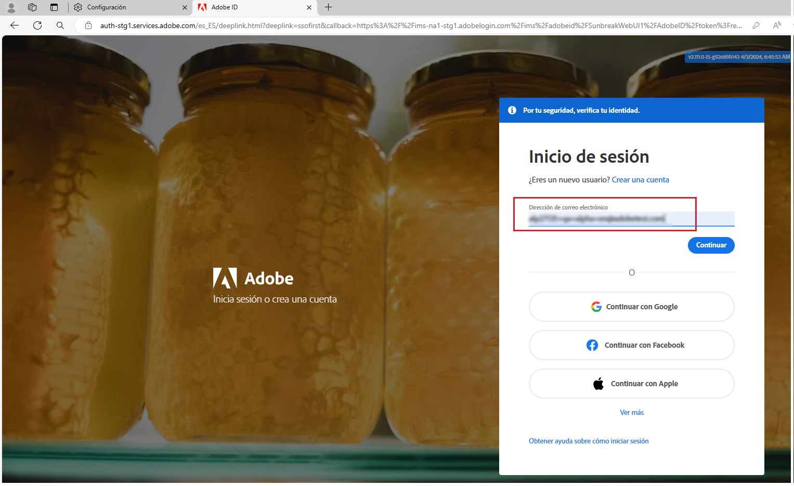
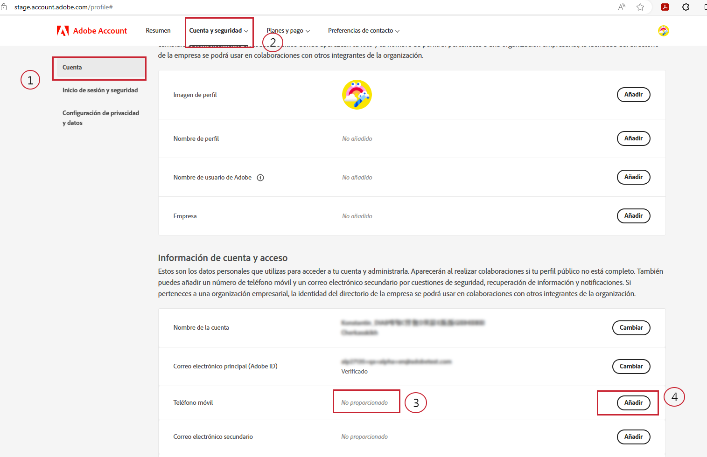
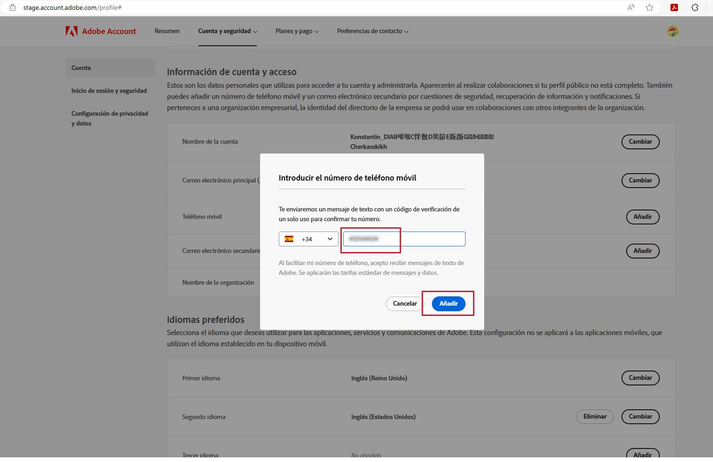
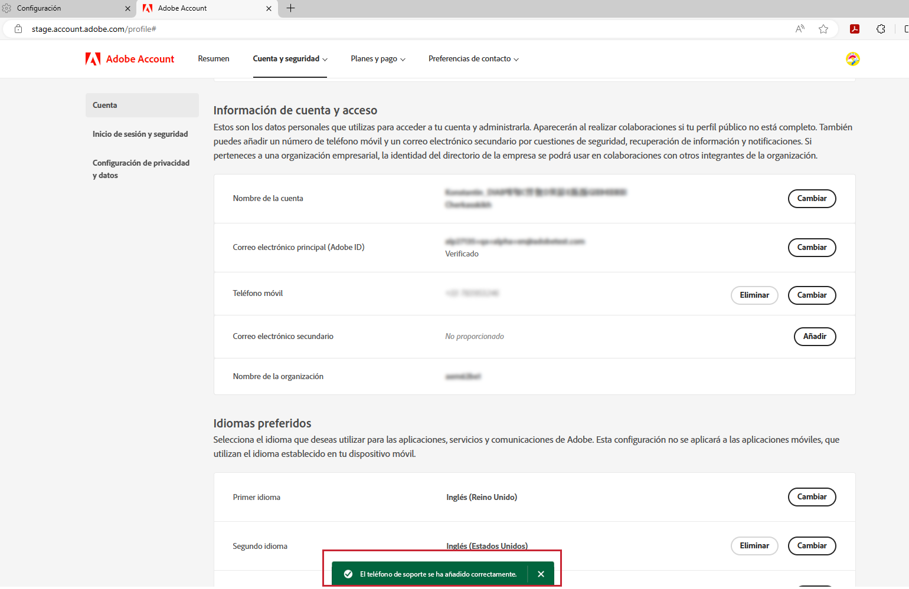

# Especificar un número de teléfono de asistencia preferido

Cuando se le asigne una función &quot;Administrador&quot; como, por ejemplo, &quot;Administrador de soporte de productos&quot;, debería recibir un correo electrónico que le informe de que tiene derechos de &quot;Administrador&quot; para administrar la instancia para la que se le han concedido derechos de administrador.

El correo electrónico ahora contiene el texto en rojo que se muestra a continuación y que explica cómo ir a su perfil de cuenta y compartir con nosotros su número de teléfono de asistencia preferido.

Para especificar su número de teléfono preferido:

1. Haga clic en **Perfil de cuenta** vínculo para abrir una nueva ventana para iniciar sesión con `account.adobe.com`.

   

1. Pase por el proceso de inicio de sesión y aterrice en la siguiente pantalla en `account.adobe.com`.
1. A continuación, haga clic en las pestañas Cuenta y seguridad > Cuenta para ver el campo Número de teléfono de asistencia.
1. Agregue aquí un número de teléfono que desee que utilicemos para reconocerle según sus necesidades de soporte.

